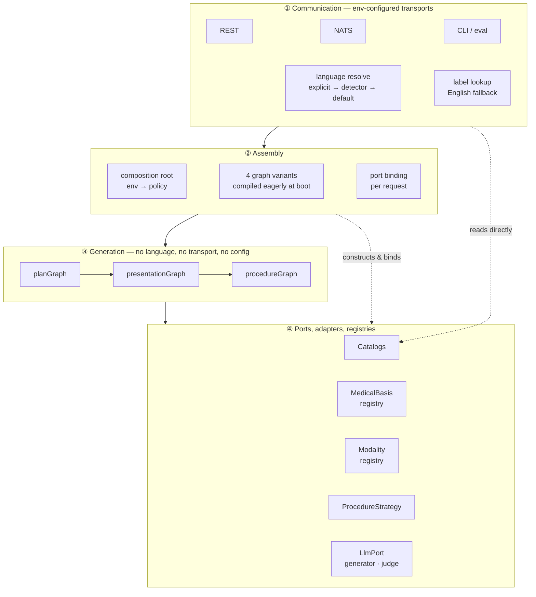
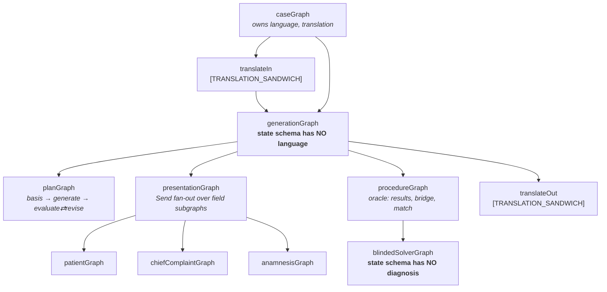
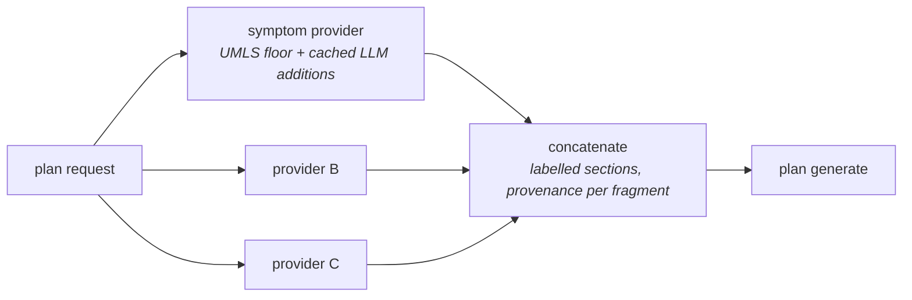
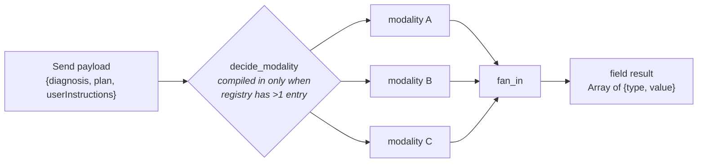
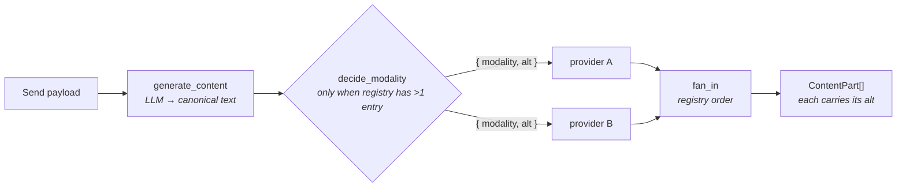
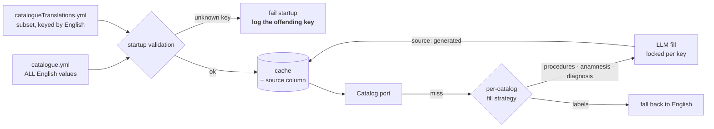
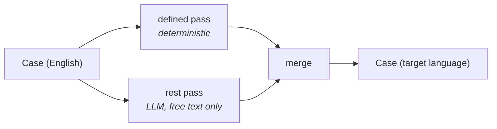

# AetioMed — Target Architecture

**Status:** Agreed design · **Revision:** 4 · **Date:** 2026-09-02 · **Branch:** `prefilter-categories`
**Scope:** `src/` in full — graph, transports, catalogs, extension system
**Endgoal assumed throughout:** open-source software that a third party deploys and configures for their own institution.

## How this doc relates to the others

| Document | Owns | Treated here as |
|---|---|---|
| `docs/engineering-review.md` | Bug list, prompting, eval-harness gap | Settled. Only its *architectural* findings are revisited. |
| `docs/translation-decoupling.md` | Field-ownership semantics of translation, catalog contract, payload identity | Settled. This doc supplies the structural half. |
| `docs/human-in-the-loop.md` | Plan review gate, checkpointing, job resource | **Deferred.** Split out of this doc; three cheap "design now" items are carried into §13. |
| `docs/issues/` | One file per development step, plus future work | Derived from §13 of this doc. |
| **This document** | Layering, configuration surface, extension points, deployability | — |

Revision 2 folds in the owner's decisions. Where a decision carries a cost or an unresolved question, it is marked **⚠ Concern** inline — those are recorded, not blocking.

---

## 0. Decisions

### 0.1 What we are building

| # | Decision | Section |
|---|---|---|
| 1 | Transports configured by **env vars only**; interface kept as `CaseGenerationService` | §3 |
| 2 | Exactly two compile-time flags: `TRANSLATION_SANDWICH`, `PROCEDURE_PRESELECTION`. `LLM_SMALL` deleted outright, no back-compat | §4.1 |
| 3 | Flag-based compilation, **all combinations built eagerly at boot**. Absent flag ⇒ node absent. `generationFlags`, `difficulty`, `language` stay in the request body | §4.2 |
| 4 | `graph:export` emits **all four** diagrams, named by activated flags | §4.2 |
| 5 | **Sandwich on:** generation is English-only; only translate-out binds foreign catalogs. **Sandwich off:** user-visible fields in target language, **all internal artifacts stay English** | §5.1 |
| 6 | LLM-filled catalog translations are **locked per key**, first-writer-wins, with retries shared by every waiter on the same key | §5.2 |
| 7 | Target language reaches the model as a **system-prompt directive for free text only**; controlled vocabulary is handled by the grammar | §5.3 |
| 8 | Language auto-detect: laddered, deterministic-first, driven by `userInstructions`, language set extensible via config | §5.4 |
| 9 | **Each presentation field gets its own subgraph**, with a decide-modality node, parallel modality fan-out, and fan-in | §6.4 |
| 10 | **Medical basis concatenates** all providers — no decision node. **Modality** compiles a decide node in only when the registry holds more than one entry | §6.3, §6.4 |
| 11 | The symptom phase becomes one medical-basis provider among others | §6.3 |
| 12 | Multimodal fields become `Array<{ type: mime, value: byte[], alt: string }>` — **additive parts, all rendered**. Providers need not be LLMs; `byte[]` unifies their return values. Text is a **normal modality entry** | §6.4, §11 |
| 12b | **`alt` is an input to the provider, not an output.** Every render request carries plain-text `alt`; the provider turns it into bytes. The same `alt` is what judges, prompts and the blinded solver read | §6.4, §11.2 |
| 12c | Wire encoding: **`text/*` → UTF-8 string, everything else → base64** | §11.1 |
| 13 | Translation splits into **defined** (deterministic / MIME-aware) and **rest** passes, merged into one case | §11.3 |
| 14 | Catalogs: `source` column; fail startup on unknown keys **for every catalog**, logging the offending key; LLM fill for procedures/anamnesis/diagnosis; English fallback for labels; configurable input and cache directories | §7 |
| 15 | Labels: **no LLM translation at all**. Use a translation if present, else English | §8 |
| 16 | Extension system deleted | §9 |
| 17 | Separate LLM config for **generator**, **judge** and **translator**, each falling back to the general LLM | §10.5 |
| 18 | Human-in-the-loop deferred to `docs/human-in-the-loop.md` | — |

### 0.2 Open concerns with those decisions

Recorded so they are not rediscovered later. None blocks implementation.

| Concern | About | Severity |
|---|---|---|
| Large binaries inline as base64 — fine for small images, untenable around a megabyte | §11.1 | Medium |
| Fail-startup on unknown label keys means a cosmetic typo takes the server down | §7.2 | Low |

**Resolved in revision 4:** the no-text-provider starvation risk (§6.4 — `alt` is now an input, so the guarantee holds by construction), and the wire-encoding question (§11.1).
**Resolved in revision 3:** export-all-variants (§4.2), English internal artifacts in non-sandwich mode (§5.1), basis concatenation instead of a decide node (§6.3), text as a normal modality entry (§6.4).

---

## 1. Where the code is today

The facts below are verified against the current tree and are the ones that shape the target.

| Finding | Consequence |
|---|---|
| `runWithContext` **never sets `language`** on the AsyncLocalStorage context (`utils/context.ts:42`). Language travels only via LangGraph's runtime context. | Two context mechanisms share one type; the ALS field is dead. Free to remove. |
| Subgraph **state is filtered** by the child's schema (`pregel/io.js:81`), but **context is not** — `_validateContext` parses and then discards the result (`graph/state.js:552`). | Splitting graphs isolates state, never context. See §6.1. |
| `translate_values` runs *after* the cache-backed translators and the `case` reducer is a shallow merge, so it **overwrites** them. | The controlled vocabulary guarantees nothing today. §11.3 fixes this structurally. |
| `translateMissing` dedupes on the **whole missing-key set** (`dedupKey = lang + sorted(missing)`), and `save` upserts. | Two concurrent requests with overlapping-but-different missing sets both call the LLM and can disagree. §5.2 fixes it. |
| Symptoms are read in **exactly one place** — the plan prompt. Not by the judge, not by field generators, not retained in output. | Already a pure plan-enrichment step; becomes a medical-basis provider unchanged. §6.3 |
| `ProcedureGraphStateSchema` **picks `diagnosis` into state**, so `blindedStep` receives it and merely declines to use it. | The blinded/oracle asymmetry is convention, not structure. §6.1 fixes it. |
| `LLM_SMALL` gates **exactly one thing**: `useSmallModelSplit` in the procedure phase. | Deleting it costs nothing. §4.1 |
| `Language` is a closed two-value enum and `CaseGenerationRequestSchema` derives from it. | Adding a language edits source *and* changes the public API. §10.2 |
| `ctx.dep()` has **zero call sites**; `tracingPersistency` subscribes to an event nothing emits. | §9 |
| `zod` vs `zod/v4` is a subpath split *within* v4, not a version mismatch. | The inlined `PresentationSchema` works around a non-problem. Delete it. |

---

## 2. Target information flow

Four layers, and one rule that carries the design: **the generation layer only ever touches ports, and ports are constructed by the layer above it.**



The two dashed arrows carry the design. Assembly *constructs* adapters and hands the graph a port bundle — the graph never imports an adapter, never reads `process.env`, never reads a module singleton. And the communication layer touches catalogs directly (label lookup, diagnosis validation), so **catalogs sit beside the graph, not underneath it**.

---

## 3. Communication

`CaseGenerationService` is the single application seam; transports are adapters over it.

```ts
interface CaseGenerationService {
  generate(req: CaseGenerationRequest): Promise<CaseGenerationResult>;
  cancel(jobId: JobId): boolean;
}
```

Everything the two transports currently duplicate — ICD→name resolution, jobId minting, `runWithContext`, terminal event emission, error→status mapping — moves here once. This closes the live defect where the NATS path silently drops `difficulty`.

> **Terminal events move too.** `Generation Completed` is emitted by the *transports* today, so any caller invoking `generateCase` directly gets no terminal event and persistence silently sees nothing. It belongs to the service.

**Configuration: environment variables only.**

```
COMM_REST=true          REST_PORT=3030
COMM_NATS=false         NATS_URL=…
TRANSLATION_SANDWICH=true
PROCEDURE_PRESELECTION=true
```

| | Alternative | Kept because |
|---|---|---|
| **A** | **Env vars only — chosen** | Container-native; one source of truth; smallest surface to document |
| B | Env + optional config file, env wins | If nested provider/registry config outgrows flat keys — likely once §6.3 has several providers |
| C | CLI flags + env + file | If a CLI entry point appears (eval harness) |

B is the most probable future move: registry entries with per-provider timeouts, trust levels and MIME capabilities do not flatten into env keys comfortably. Parsing config into an object from the start keeps that door open at no cost.

Ship `--print-config` regardless. For open-source software, echoing every resolved value at startup is what turns "it doesn't work" issues into self-service.

---

## 4. Assembly and flags

### 4.1 Two flags, no grouping

```
TRANSLATION_SANDWICH=true|false
PROCEDURE_PRESELECTION=true|false
```

`SMALL_LLM` / `LLM_SMALL` is **deleted outright**, with no alias and no deprecation period. Verified safe: `LLM_SMALL` gates exactly one behaviour, `useSmallModelSplit` in the procedure phase, which `PROCEDURE_PRESELECTION` replaces one-for-one. Nothing else reads it.

This removes the whole class of problem the grouping flag created — undefined override semantics, a name describing a model property rather than a topology, and a deployer unable to predict the pipeline from the config.

Note `LANGUAGE_AUTO_DETECT` is *not* in this list. It lives in the communication layer (§5.4), so it is not a graph flag and does not multiply topologies.

### 4.2 Compilation

**Flag-based, all combinations, eager at boot.** Two booleans give four topologies:

| | `TRANSLATION_SANDWICH` | `PROCEDURE_PRESELECTION` |
|---|---|---|
| 1 | off | off |
| 2 | off | on |
| 3 | on | off |
| 4 | on | on |

Four is small enough that named variants buy nothing — that objection was premised on four flags giving sixteen. With two flags, flag-based compilation is the simpler answer *and* it keeps each subgraph independently testable, which was the point.

**Eager at boot, not lazy.** Repos sync YAML at *import* time and `resolvePredefinedList` can call `process.exit(1)`. Lazy compilation would move a possible process exit from boot to the first request that happens to need that variant.

**Absent flag ⇒ absent node.** Not a skipped node, not a conditional edge — the node is never added. The same rule extends to registry-driven decide nodes (§6.3, §6.4).

**Per-request, not compiled away:** `generationFlags`, `difficulty` and `language` stay in the request body and drive runtime branching. The rule to write down: *compile on what the deployer chose; branch on what the caller asked for.*

One consequence worth handling: `generationFlags: ["procedures"]` alone is schema-valid today, produces an empty presentation fan-out, and hands the blinded solver an empty patient — after paying for a plan and up to three evaluations. Decide whether presentation fields are a prerequisite of `procedures` and enforce it at the API boundary.

**Export:** `graph:export` emits **all four** diagrams, named by the flags that produced them:

```
docs/graphs/case-graph.none.svg
docs/graphs/case-graph.procedure-preselection.svg
docs/graphs/case-graph.translation-sandwich.svg
docs/graphs/case-graph.translation-sandwich+procedure-preselection.svg
```

Every deployer can then find the picture of the pipeline they are actually running. The diagram set becomes the configuration documentation.

Also worth doing now: `export const caseGraph` is consumed directly by `exportGraphs.ts` and re-exported from `graph/index.ts`. Turning it into `getCaseGraph(flags)` costs one line today and about twenty call sites later.

---

## 5. Language

### 5.1 Catalog binding differs by mode

This is the sharpest simplification in revision 2, and it is better than what the previous revision proposed.

| Mode | Generation binds | Translate-out binds |
|---|---|---|
| **Sandwich on** | English catalogs only — generation never sees a foreign term | Target-language catalogs |
| **Sandwich off** | Target-language catalogs, used directly as generation vocabulary | *(no translate-out)* |

In sandwich mode the generation core is *provably* monolingual: the only component that ever holds a foreign catalog is the second half of the sandwich. In non-sandwich mode the target-language catalog is bound at the port and becomes the grammar the model picks from — so the model never translates a controlled term, it selects one (§5.3).

The graph is structurally identical in both modes. Only the bound port differs. That is the signal the decomposition is right, and it is why languages do **not** multiply the four compiled variants.

#### Non-sandwich mode keeps its internal artifacts in English

The pipeline has two classes of LLM output, and only one of them is user-visible:

| Class | Examples | Language, sandwich **off** |
|---|---|---|
| **Internal artifacts** | the plan, the plan judge, the blinded solver's reasoning, `matchDiagnosis` | **English, always** |
| **User-visible fields** | chief complaint, anamnesis answers, procedure result text | Target language, generated natively |

Roughly 60% of the pipeline's LLM calls produce artifacts the student never sees. Those run in English regardless of mode: English is the thicker slice of every model's clinical training distribution, an English canonical core keeps the ICD-keyed caches language-invariant, and it keeps generations comparable across languages for evaluation.

Mechanically this is one extra port binding, not a new concept. The LLM port is already role-based (§10.5), so the *internal* roles bind an English-directive model and the *user-facing* roles bind a target-language one. Native generation is kept exactly where it earns its keep — patient voice and register — and nowhere else.

### 5.2 Deterministic LLM fill — per-key locking

The requirement: when a translation is missing and gets LLM-filled, parallel requests must converge on one value.

**This is currently broken, and not subtly.** `translateMissing` builds `dedupKey = lang + sorted(missing)` — a key over the *whole set*. Two concurrent requests needing `{A,B}` and `{B,C}` produce different dedup keys, so both call the LLM, both generate a value for `B`, and both `save()` via upsert. Last writer wins, and the two calls can disagree.

Three layers fix it:

1. **Lock per key, not per set.** An in-flight map keyed by `(domain, lang, key)` holding a promise per key. A request computes its missing set, claims the keys nobody has claimed, awaits the promises for those already in flight, and issues **one** LLM call for its own claimed subset. Overlapping requests share a value instead of racing for it.
2. **First-writer-wins at the database.** `INSERT … ON CONFLICT DO NOTHING`, then read back the stored row rather than trusting the local generation. Convergence then holds across processes and replicas, not just within one event loop.
3. **Never regenerate an existing key.** With the `source` column (§7.1), a `generated` value is as sticky as a `curated` one until a human promotes it. Determinism over time, not only under concurrency.

Together: for a given `(domain, lang, key)`, exactly one value ever exists — whichever writer got there first.

#### Retry semantics — waiters share the retry, not the failure

The lock must not turn a transient failure into a stampede or into a spurious error for everyone who happened to be waiting. Three rules:

1. **Retries live inside the shared promise.** The promise registered in the in-flight map wraps the *whole* retry loop, not a single attempt. Every request awaiting that key therefore receives the result of the successful retry, not the first attempt's error.
2. **On ultimate failure, reject every waiter *and* clear the entry.** All current waiters get the same rejection — one failure, reported once — and the in-flight entry is removed so the next request starts a fresh attempt rather than inheriting a cached failure. This is the bug pattern the Redis client already has elsewhere in this codebase, where a failed connect caches `null` permanently; do not repeat it.
3. **Partial batch success is per key, not per batch.** One LLM call may cover several missing keys and return only some of them. Resolve the promises for keys that came back, and put the keys that did not into the *next* retry attempt. A single stubborn term must not fail the translations of its batch-mates.

Failure of the fill is never fatal to the request: the caller falls back to the English key, exactly as labels do (§8). A missing translation degrades presentation; it must not fail a generation.

> **Residual, worth stating in the README.** This gives determinism *per deployment*, not *across deployments*. Two installs can generate different German names for the same procedure. If cross-deployment stability matters — shared question banks, published cases — the answer is to ship curated translations in the YAML, not to lean on LLM fill.

### 5.3 How the target language reaches the model

You asked for a proposal rather than a decision. Here it is.

**The key move is to split the problem in two, because only one half needs prompting at all.**

| Field kind | Mechanism | Cost |
|---|---|---|
| **Controlled vocabulary** — procedure names, anamnesis categories, enums like `relevance` | The **grammar**. In non-sandwich mode the catalog port is bound to the target language, so the literal union in the structured-output schema already contains target-language terms. The model *selects*; it never translates, and it cannot emit an off-vocabulary term. | Zero |
| **Free text** — chief complaint, anamnesis answers, procedure result text | A **system-prompt directive**, appended by the LLM port | One line per call |

That asymmetry matters: the highest-risk fields — where a wrong term is clinically meaningful — are handled structurally, and prompting is confined to prose, where drift is cosmetic.

**The directive.** Appended by the LLM port as the final line of the *system* message, not the user message: it is constant per language, so it stays inside the stable prefix and does not disturb prompt caching.

```
Output language: {language}.
Write all free-text field VALUES in {language}.
Field names, enum values and identifiers are fixed by the schema — reproduce them exactly, untranslated.
```

The second sentence is load-bearing. Under structured output, a model asked to "answer in German" will cheerfully translate JSON keys and enum members. `relevance` is `obligatory | optional | contraindicated`; the grammar will reject a translated value, but the retry costs a call, so say it once up front.

**Three hardening options, in cost order:**

| | Technique | When to add it |
|---|---|---|
| 1 | Localized `.describe()` text on the Zod schema fields | Cheap, and models follow schema descriptions well. Add alongside the directive |
| 2 | One in-language exemplar for the highest-drift field — anamnesis answers, which need patient voice and register | If register, not correctness, is the complaint |
| 3 | Post-generation language check using the **same n-gram detector as §5.4**, retry once on mismatch | **Deferred** — see `docs/issues/F02-language-output-validator.md` |

Option 3 is deferred to future work. Worth noting why it is cheap when you want it: the detector added for auto-detection doubles as an output validator, so the language ladder and the language guarantee share a component and no new dependency is needed.

**Keep the language-specific ports.** Language is a property of the bound ports — catalog and LLM — not of graph state or runtime context. The graph is language-agnostic because it only ever touches ports.

Two mechanical notes carried forward: `RequestContextSchema` is a Zod schema LangGraph validates, so putting port *functions* in it means loosening it to `z.custom` — the lower-friction path is to carry ports in the existing `AsyncLocalStorage`. And ports carried that way are invisible to checkpoints, so anything resumable must rebuild them.

**Do not compile per flags × language.** Confirmed: four variants total, languages bound at invoke.

### 5.4 Language auto-detection

A laddered resolver in the communication layer, before port binding:

```
1. language explicitly provided       → use it                      (no cost)
2. deterministic n-gram detector      → use it if above threshold   (no cost, offline)
3. LLM fallback, only if enabled      → one cheap call              (rare)
4. otherwise                          → configured default          (English)
```

**Detect on `userInstructions`, never the diagnosis name.** Two reasons, both decisive: when a request supplies only `icd`, the diagnosis name is resolved from your own English catalogue, so detecting on it is circular; and diagnosis names are 2–3 words and frequently Latin — *"Diabetes mellitus"* is byte-identical in English, German and Spanish. `userInstructions` is the only field with enough free text to detect on.

**Extensibility.** The supported language set comes from configuration, not a source-level enum (§10.2). The ladder must therefore degrade honestly:

- Startup validates that every configured language has a catalog translation file, and warns for any the detector library does not support.
- A language the detector cannot recognise simply never wins step 2 — it stays fully usable when passed explicitly at step 1. Detection is a convenience, never a gate.
- The resolved language is **echoed in the response**, so a client can notice a wrong guess and retry explicitly.

Treat detection as a hint with a confidence threshold, not an authority. A coin-flip on two Latin words should not silently choose the output language of a clinical teaching case.

---

## 6. Generation

### 6.1 Graph decomposition — what earns its own graph

Subgraph **state is filtered** by the child's schema — `pregel/io.js:81`, `for (const k in chunk) if (inputChannels.includes(k))`. A key absent from the child's schema never enters its channels. Subgraph **context is not** filtered — `graph/state.js:552` parses against the context schema and then discards the result, returning the original object.

So splitting buys a real, runtime-enforced boundary on state, and none at all on context. `language` is kept out of both regardless (§5.3).

**Four reasons a subgraph earns its own state schema.** If none applies, plain nodes are simpler.

| Reason | What it buys | Where it applies |
|---|---|---|
| **Isolation** | A key omitted from the child schema is unreachable, by construction | Blinded solver must not see `diagnosis` |
| **Internal control flow** | Loop counters and feedback stay out of the parent's state | plan evaluate⇄revise; 6-iteration solver; modality fan-out |
| **Independent invocability** | Run, test, checkpoint it alone | per-field subgraphs; plan graph for the eval harness |
| **Independent variability** | Swapped or omitted wholesale by a flag or registry size | translation; procedure strategy; decide nodes |

**Cost, so you can price it:** each subgraph adds a state schema, a compile step, a trace namespace and a node in `graph:export`; checkpoint namespaces nest. Three levels is a sensible ceiling — the tree below is exactly three.

#### The split that buys the most

`ProcedureGraphStateSchema` **picks `diagnosis` into its state**, so `blindedStep` receives it and merely declines to use it. The blinded/oracle asymmetry — the best idea in the pipeline — is convention, not structure. Split the blinded step into its own subgraph whose state schema **omits `diagnosis`**; the oracle nodes stay in the parent. The parent passes down a presentation and gets a `SolverMove` back, and the guarantee becomes structural.

#### Target graph tree



### 6.2 Pipeline shape

Three stages: **plan → presentation → procedures**. The symptom phase does not disappear; it is reclassified as a medical-basis provider (§6.3).

The plan remains the single source of truth: downstream generators render its facts and invent nothing. That property is what makes per-field subgraphs safe to parallelise.

### 6.3 Medical-basis registry — concatenate, don't decide

The symptom phase becomes **one provider among others**. There is no decision node:

- **0 providers** → the basis node is not compiled in at all. Zero cost, no code path.
- **≥1 provider** → **all** applicable providers run and their fragments are **concatenated** into the plan's input.

No LLM call is ever spent deciding *which* knowledge to use, at any registry size. That is a stronger guarantee than the original "zero LLM when empty" requirement, and it is also usually the better answer clinically: if a UMLS lookup and a PubMed lookup both have something to say, the plan is better for having both than for having whichever one a router picked.



Two properties the concatenation must have:

- **Deterministic order.** Fragments are concatenated in registry order, not completion order, so the same configuration produces the same prompt every time. Otherwise the plan prompt varies run to run and evaluation becomes meaningless.
- **Labelled sections with provenance.** Each fragment carries `sourceId`, `retrievedAt` and `licence`, and is rendered under its own heading. A deployer using a licensed source has an attribution obligation, a teaching hospital will want citations, and — see below — the label is also the security boundary.

> **⚠ Prompt injection.** Third-party provider content lands verbatim in the plan prompt, which is the single source of truth for the entire case. Fence each fragment and tag it as data, not instructions. A poisoned fragment here produces a wrong clinical teaching case, not a funny chatbot reply.

**Future work — a decision node.** If provider count or cost ever makes concatenation impractical, a selection step can be added *in front of* the concatenation without disturbing anything downstream: providers gain a deterministic `appliesTo(request)` predicate, and only if more than one provider is *applicable* does an LLM tiebreak run. Tracked in `docs/issues/F03-medical-basis-decision-node.md`. The concatenation design is deliberately the degenerate case of that one, so the upgrade is additive.

### 6.4 Presentation — per-field subgraphs and modality

Each presentation field becomes its own compiled subgraph, invoked via the existing `Send` fan-out (a compiled subgraph is a valid `Send` target, so the parent changes by one line per field).



- `decide_modality` reads the **modality registry** and returns the list of modalities to execute for this field.
- Those execute **in parallel** and fan in to a single `Array<{ type, value }>`.
- The decide node is **compiled in only when the registry holds more than one entry** — matching §6.3.
- Registry entries declare which **MIME types** they produce; the decide node chooses among declared types.

Keeping the `Send` payload uniform across all three fields is what keeps this cheap. Resist adding a field only one generator needs.

**Text is a normal registry entry**, not an implicit floor. That makes the rule total:

| Registry size | Behaviour |
|---|---|
| 0 | Misconfiguration — reject at startup |
| 1 | That provider runs directly. No decide node is compiled in |
| >1 | A decide node is compiled in and chooses which modalities to produce |

It also means text is swappable like anything else, and — as you note — a deployer may legitimately configure a registry containing *only* image generation.

#### Generation and rendering are separate steps

The concern raised in revision 3 — that an image-only registry starves the plan judge and the blinded solver, which read field content as prose and cannot read a PNG — is resolved by making `alt` an **input** rather than a provider output.



1. **`generate_content` always runs.** It produces the field's canonical text — this is exactly what the field generators do today. It is not a modality provider and is not registry-gated.
2. **`decide_modality` plans a composition**: an ordered list of render requests, each `{ modality, alt }`. `alt` is plain text describing what that part should convey — *"an image of a broken right leg"*.
3. **Each provider is called with its `alt`** and returns bytes. A provider's job is to *render* text into a modality, never to describe its own output.
4. **Each resulting part retains the `alt` it was rendered from.**

Three things fall out, and they are why this is better than the provider-obligation design I proposed:

- **The text guarantee is structural, not a provider contract.** `alt` exists *before* any provider runs, so no provider can omit it and there is nothing to validate at startup. An image-only registry is now completely safe: the canonical text is still generated, every part still carries text, and the blinded solver still has prose to reason from.
- **No round-trip fidelity loss.** A provider-generated description would be image → text, which can drift from what was intended. Here the description *is* the intent, authored before the render.
- **Providers get simpler.** The interface is `(alt: string, ctx) => Promise<Uint8Array>` — no LLM assumption, no self-description, trivially fakeable in tests.

The registry now controls only **which renderings are emitted**, not whether text exists. `0` entries remains a misconfiguration; `1` entry runs directly with no decide node; `>1` compiles the decide node in.

> **⚠ Concern (medium) — realization runs before translate-out.**
>
> You asked to set the audio/translation ordering aside for now, which is reasonable: images are the likely first modality and an X-ray carries no language. Recording the consequence so it is not rediscovered as a bug: with the sandwich on, a modality realised inside the field subgraph is generated from **English** text and will not be translated by translate-out, because it is not text. Images are mostly fine; burnt-in annotations, speech and audio are not.
>
> The migration path stays open as long as the decide step and the realization step are **distinct nodes** — which the diagram above already has. When it matters, realization moves to a post-translation phase and the decide node stays put. Keeping those two separate now is what makes that a move rather than a rewrite.

Minor note: the parallel fan-out is nominal against a default local Ollama, which serialises requests (`OLLAMA_NUM_PARALLEL=1`). Real parallelism arrives with cloud providers or a tuned Ollama.

### 6.5 Procedures

`PROCEDURE_PRESELECTION` selects a `ProcedureStrategy` at assembly:

| Flag | Strategy |
|---|---|
| off | `DirectPick` — one call against the full candidate list |
| on | `CategoryScopedPick` — category pick, then a procedure pick scoped to it |

Both implementations already exist in the code as branches of `if (config.LLM_SMALL)` inside `blinded_step`. Converting them to adapters removes five of the eight procedure tools and roughly seven near-duplicate gateway functions, and the graph shape stays fixed at three nodes.

Procedure results carry the same multimodal shape as presentation fields: `result` becomes `Array<{ type, value }>`, and modality providers declare which MIME types they produce (§11).

`BlindedView` and `OracleView` become distinct types, backed structurally by the state split in §6.1.

---

## 7. Catalogs

The contract: **the base YAML is the complete English vocabulary and the identity space; translation files are a partial, keyed subset.**



Rule 4 in `predefinedList.ts` — which lets translations define the vocabulary when no base list exists — is deleted. It inverts the intended contract and is the sole reason `language` currently reaches six call sites inside the generation core.

### 7.1 Provenance

Add `source: 'curated' | 'generated'` to the `translation` table. Without it a hallucinated German procedure name is cached permanently and is indistinguishable from a clinician-reviewed one — for medical software being open-sourced, a safety property rather than a nicety. Ship a CLI to list `generated` entries for review and promotion into YAML.

### 7.2 Startup validation

**Unknown key ⇒ fail startup, for every catalog including labels.** The error must name the offending key and file:

```
[labels] data/labelTranslations.yml declares a key absent from the catalogue.
         Unknown key: "Choosing next procedur" (German)
         Did you mean:  "Choosing next procedure"?
```

> **⚠ Concern (low).** A typo in a cosmetic UI label now takes the whole server down at boot. That is a deliberate trade — one rule for all catalogs is easier to explain and impossible to get subtly wrong — and the named-key log makes the fix a ten-second job. The residual risk is a deployer editing labels in production and bricking a restart; the mitigation is validating catalogs via `--print-config` before deploy. The near-match suggestion above costs little and removes most of the sting.

### 7.3 Missing translations

| Catalog | Missing key |
|---|---|
| procedures, anamnesis, diagnosis | LLM fill, per-key locked (§5.2), stored as `generated` |
| labels | fall back to English, no LLM (§8) |

### 7.4 Configurable directories

Two new settings, because there are currently **11 hardcoded `data/*.yml` paths** resolved against `process.cwd()`, and a deployer's only option is mounting a volume over `data/` — which also clobbers `data/cache/`, where the SQLite DB lives:

```
CATALOG_DIR=/etc/aetiomed/catalogs     # input: read-only, deployer-owned
CACHE_DIR=/var/lib/aetiomed/cache      # output: writable, generated
```

Separating input from output is what makes the catalogs replaceable at all.

### 7.5 Scope of the catalog module

The module owns the whole vocabulary concept, not just the list: parsing, validation, the category taxonomy, scoping, exclusion of already-ordered items, and candidate rendering. Roughly 240 lines of that currently live inside `procedures.aigateway.ts` (lines 132–370).

---

## 8. Labels

**No LLM translation of labels at all.** If a translation exists for a key, use it; otherwise emit English.

This is simpler than both the current design and the previous proposal, and it removes several things at once: the pre-warm block in `caseGraph.ts`, `resolveLabel`, `knownLabels`, `getKnownLabels`, and any need for the communication layer to hold an LLM handle. Label localisation becomes a synchronous dictionary lookup in the transport.

Labels are still validated at startup like every other catalog (§7.2) — unknown keys fail, missing keys are simply absent and fall back.

Note the current SSE consumer never receives a `label` at all (the tracing extension forwards only `{node, timestamp}`), so moving localisation outward also fixes an inconsistency where NATS and SSE consumers saw different payloads.

---

## 9. Extension system — deleted

Replaced by an explicit composition root in `app.ts`. The evidence that it was never load-bearing:

| Evidence |
|---|
| `ctx.dep()` — the framework's cross-extension mechanism — has **zero call sites** |
| Extensions import each other's mutable `let` bindings instead (`apiRouter` imported by four) |
| Four extensions mount at `use("/", …)`; `/api/cases` GET resolves to `persistencyRouter` only because `casesRouter` happens to define no `GET /` |
| `tracingPersistency` subscribes to an event nothing emits — it has never worked |
| Extensions with `requiredFlags: []` load silently whenever their dependencies do |
| `api` has an empty `setup()` — a Zod schema module wearing the extension interface |

Delete `persistency`, `tracingPersistency`, `tracingNats`, `debugLogger`, `swagger`, the loader, the registry codegen and `_registry.ts`. What remains — `api` (types), `rest`, `nats`, `tracing` — is exactly the communication layer of §3, constructed explicitly.

**Keep the `EventBus`.** It genuinely decouples tracing from the graph.

The plugin axis that actually matters is the **port** axis — medical-basis providers, modality providers, catalog sources, LLM providers. That is where a deployer needs to add code without forking, and where MCP fits naturally. The old system plugged in one layer too high.

**Also delete:** `RequestContext.language` (never populated); the inlined `PresentationSchema` and its stale zod-version comment; `getRequiredRequestContext`, `decodeObject`, `parseStructuredResponse`, `parseStructuredResponseAgent`, `getSearchTool` (no call sites). And invert the `core/graph/utils/context.ts → extensions/tracing` import so core depends on nothing under `extensions/`.

---

## 10. Open-source concerns

### 10.1 No `LICENSE` file

Blocking, and a deliberate choice: permissive (MIT/Apache-2.0) maximises adoption; AGPL matters if a hospital running it as a hosted service should contribute back. Apache-2.0 additionally grants patent rights, which institutional legal teams look for.

### 10.2 `Language` must become configuration

`z.enum(["English", "German"])` in source, with `CaseGenerationRequestSchema` derived from it — so adding French edits source *and* changes the public API contract. The supported set must come from deployment config, validated at startup against which catalogs actually have translations. §5.4's ladder depends on this.

### 10.3 Verify ICD-11 and UMLS redistribution rights before publishing

`data/` holds ~5.2 MB of ICD-11-derived YAML and ~2.6 MB of UMLS-derived symptom data, committed to the repo. Both carry terms governing redistribution of derived content, and UMLS access is individually licensed. Check before publication, not after. The likely resolution is already half-built: ship `scripts/extract-icd11*.ts` and a documented ingestion step rather than the corpora — which also makes catalogs deployer-replaceable, as §7.4 wants.

### 10.4 Config in one place

`src/config.ts`, `graph/config.ts`, per-extension `envSchema`, and `graph/config.ts` reading `process.env.FEATURES` inside a Zod `.transform()`. One schema, one parse, one echo. Related: `CaseGenerationRequestSchema` reads the `config` singleton inside three `.refine()` callbacks, so the public request schema depends on module load order.

### 10.5 Separate LLMs for generator and judge

```
LLM_PROVIDER / LLM_MODEL / …                     # general fallback
LLM_GENERATOR_PROVIDER / LLM_GENERATOR_MODEL     # optional
LLM_JUDGE_PROVIDER / LLM_JUDGE_MODEL             # optional
LLM_TRANSLATOR_PROVIDER / LLM_TRANSLATOR_MODEL   # optional
```

Each role falls back to the general configuration when unset. Roles cover:

| Role | Used by | Wants |
|---|---|---|
| `generator` | plan generation, field generators, procedure steps, bridge | clinical reasoning, instruction following |
| `judge` | plan evaluation, `matchDiagnosis` | calibration; benefits most from a stronger model |
| `translator` | translate-in, the rest pass, catalog LLM fill | target-language coverage; high volume, low creativity |

**This is a stronger change than it looks.** `engineering-review.md` §6.4 identifies the pipeline's structural blind spot: generators and judges are the same model, so it cannot detect its own systematic errors — a model that thinks a case is subtle will also judge it subtle. Role-separated configuration is the cheapest available fix, and it enables the setup that works well in practice: a small local model generating, a stronger model judging, since judging is a fraction of the call volume.

Implementation lands on the LLM port. Roles cover the plan generator, field generators and procedure steps (generator); the plan judge and `matchDiagnosis` (judge).

The `translator` role matters more here than it looks, because §5.1 now binds *language* per role: internal roles always emit English, user-facing roles emit the target language. Role is therefore already the axis language travels on — adding `translator` as a first-class role costs one enum member and makes the sandwich's model independently configurable from the model that writes the case.

The existing `getLLM` / `getDeterministicLLM` / `getCreativeLLM` split varies temperature by task; role-based configuration generalises it. Three dimensions — role, temperature, and output language — all belong on the port.

### 10.6 No test runner — and it blocks your own guarantees

No `*.test.ts`, no vitest or jest. This is load-bearing here: "registry empty ⇒ zero LLM calls" cannot be enforced without a call counter, and `getLLM()` has no injection seam. Per-field subgraphs, four compiled variants, and per-key translation locking are all things that cannot be verified by running one case by hand — the locking especially, since it is a concurrency property.

And for open source specifically: third parties will write providers. A **provider contract-test kit** they can run against their own implementation is the highest-leverage artifact in this design space, and it is cheapest to write while exactly one provider exists.

### 10.7 Version the Case schema

Open source plus persisted cases means `CaseSchema` is a public contract consumed by clients you will never meet. Version it before v1. §11 changes it substantially, so do both at once.

---

## 11. Multimodal content

### 11.1 Shape

```ts
type ContentPart = {
  type: string;        // MIME type
  value: Uint8Array;   // the rendered artifact
  alt: string;         // plain text: what this part conveys
};

ProcedureResult = { name, relevance, result: ContentPart[] }
AnamnesisField  = { category, answer: ContentPart[] }
ChiefComplaint  = ContentPart[]
```

**`alt` is the render request, retained.** It is the plain-text input the provider was called with (§6.4), not a description the provider produced. Every part therefore has text by construction.

**Why `byte[]` is right — a correction to revision 2.** My earlier objection assumed the LLM would emit the `ContentPart` directly and so emit base64 under structured output. Under the provider architecture it does not: `generate_content` produces ordinary text under an ordinary string schema, and a provider encodes to bytes at its own boundary. The model never sees base64. And because a provider need not be an LLM at all — an image model reached over MCP returns bytes — `byte[]` is the only return type that unifies them. I withdraw that concern.

#### Text parts: `value` is *derived* from `alt`

For a `text/*` part the rendering is the words themselves, so `value = utf8(alt)`. Treat it as a **derived** field rather than an independently authored one. That is what makes the uniform shape safe:

| | Consequence |
|---|---|
| `textOf()` is `parts.map(p => p.alt).join("\n\n")` | No `isText()` branch in any consumer |
| Translation translates `alt` only, then re-derives `value` for text parts | The two **cannot** drift, because one is computed from the other |
| The invariant "every part contributes text" is a property of the type | Nothing to validate, nothing a provider can get wrong |

The alternative — making `alt` optional and absent on text parts — avoids storing the string twice but forces every consumer to branch, and re-introduces two translation paths. The duplication is only apparent: one of the two is computed.

#### Wire encoding

`value` serializes to a JSON **string**, encoded by MIME class:

| MIME | Encoding |
|---|---|
| `text/*` | UTF-8, verbatim |
| everything else | base64 |

One field, one documented convention, and a case — which is mostly text — stays readable in a browser, a log or `curl`. For an open-source project the response body doubles as documentation.

Omit `alt` on the wire for `text/*` parts, since it is derivable from `value`; the deserializer fills it back in. Uniform in the domain, no duplication on the wire.

> **⚠ Concern (medium) — large binaries.** Inline base64 is fine for small images and untenable around a megabyte: it inflates by ~33%, and the whole case is held in memory, persisted, and passed through the response. When a provider starts returning large artifacts, the answer is an asset store — parts carry a reference instead of bytes — which is additive to this design because `type` already governs interpretation. Set a size ceiling and fail loudly above it rather than silently shipping a 20 MB JSON document.

### 11.2 Text projection

```ts
const textOf = (parts: ContentPart[]) => parts.map(p => p.alt).join("\n\n");
```

This is the **only** path from content to a prompt. The consumers are the plan prompt, the plan judge, `matchDiagnosis`, logs and traces, and above all the presentation slice handed to the **blinded solver**, which re-reads `previousProcedures` on every one of up to six iterations.

Enforce it in the type system: prompt builders take `string`, never `ContentPart[]`. **Bytes must never reach a prompt.**

### 11.3 Translation: defined and rest passes, then merge

Translation splits into two passes over **disjoint** field sets, then merges:



| Pass | Handles | Mechanism |
|---|---|---|
| **Defined** | Controlled vocabulary: procedure names, anamnesis categories. Plus any MIME-dependent rule | Catalog dictionary lookup; per-key locked LLM fill on miss (§5.2) |
| **Rest** | Every part's `alt` | One LLM pass over `alt` strings only |
| **Neither** | `value` bytes of non-text parts, enums, identifiers, numbers | Passed through untouched |

**Only `alt` is ever translated.** For a `text/*` part, `value` is then re-derived as `utf8(translatedAlt)`; for every other part `value` passes through byte-identical. So exactly one string per part reaches the translator, non-text bytes are excluded **by construction** rather than by a prompt instruction asking the model to please leave them alone, and text and alt cannot disagree after translation because one is computed from the other.

**This fixes a real bug, not just a structure.** Today `translate_values` runs *after* the cache-backed translators and returns a whole `Case` that replaces theirs through the shallow reducer merge — so the controlled vocabulary is silently overwritten by free-text LLM output, and only "works" because a model shown German usually echoes it back. Disjoint field ownership plus an explicit merge makes the controlled pass authoritative by construction, and removes the ordering dependency entirely.

It also shrinks the LLM payload: 152-character compound procedure names stop being shipped through the translation call.

---

## 12. Open decisions

Revision 4 closes the two multimodal questions. What remains:

1. **Binary size ceiling** — at what payload size does inline base64 stop being acceptable, and does exceeding it fail loudly or fall back to an asset store? Decidable when the first non-text provider lands. §11.1
2. **`procedures`-only requests** — prerequisite-and-reject, or inject the plan's presentation summary into the solver. §4.2
3. **Payload identity** — carried over from `translation-decoupling.md`: does the response expose English `id` plus localised `label`, or localised strings only? Recommend `id` + `label`. Interacts with §11.
4. **Licence**, and **data redistribution** — ship corpora or extraction scripts. §10.1, §10.3

**Closed in revision 4:** the text-projection obligation (`alt` is an input, so there is no obligation to place on providers — §6.4) and the binary wire encoding (`text/*` UTF-8, everything else base64 — §11.1).

---

---

## 13. Sequence

Every step below has a corresponding issue file in `docs/issues/`, written to be handed to a coding agent alongside this document.

| # | Issue | Work |
|---|---|---|
| 0 | `00-test-infrastructure.md` | Test runner, so the guarantees below are enforceable |
| 1 | `01-catalog-ports.md` | Catalog module and ports; delete Rule 4; move scoping out of the gateway |
| 2 | `02-catalog-config-and-validation.md` | `CATALOG_DIR` / `CACHE_DIR`; fail-fast validation naming the offending key |
| 3 | `03-translation-store-locking.md` | `source` column; per-key locking; shared retry semantics |
| 4 | `04-graph-runtime-and-ports.md` | Port bundle; kill the `bus`/`config` singletons; injectable `getLLM`; invert the tracing import |
| 5 | `05-delete-extension-system.md` | Composition root; `CaseGenerationService`; dropped `difficulty`; label fallback |
| 6 | `06-llm-roles.md` | `generator` / `judge` / `translator` roles |
| 7 | `07-procedure-strategy.md` | `ProcedureStrategy` port; `PROCEDURE_PRESELECTION`; delete `LLM_SMALL`; split the blinded solver |
| 8 | `08-graph-assembly.md` | `assembleCaseGraph(flags)`; four variants eager at boot; export all four |
| 9 | `09-language-binding.md` | Catalog binding per mode; English internals; system directive; language out of state and context |
| 10 | `10-language-detection.md` | Detection ladder in the communication layer; `Language` from config |
| 11 | `11-content-parts.md` | `ContentPart[]`; `textOf()`; wire serialization |
| 12 | `12-translation-split.md` | Defined and rest passes, then merge |
| 13 | `13-presentation-subgraphs.md` | Per-field subgraphs; modality registry; `decide_modality` |
| 14 | `14-medical-basis-registry.md` | `MedicalBasisProvider` port; concatenation; migrate the symptom phase |

**Ordering constraints that matter:**

- **1–3 before everything.** They reclaim the leaked logic and establish the injection mechanism in a bounded blast radius. Issue 3 is also a live-bug fix.
- **4 before 6–9.** Nothing can be bound per role or per language until the port bundle exists.
- **11 before 13.** The content shape is what the modality fan-out fans into; building the registry first means building it against a type that is about to change.
- **11 before 12.** The translation split routes on MIME type.
- **Steps 0–8 are refactors with no behaviour change.** 9–14 are where the new capabilities land.

Future work is tracked in the same directory with an `F` prefix: human-in-the-loop, the language output validator, a medical-basis decision node, the eval harness, the provider contract-test kit, MCP providers, schema versioning, checkpointing, and the licence and data-redistribution questions.
